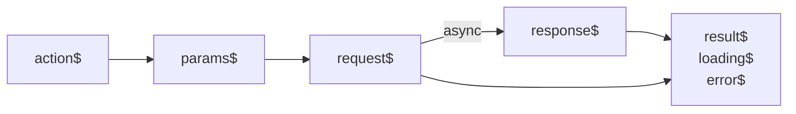

# Artery Renderer 是如何实现的

**TL;DR;**

- Artery Render 基于 RxJS 实现了 MVC 中的 Model, 基于 React Hooks 实现了 Controller。
- Artery Render 将获取组件和构造 API 请求等，在不同场景中实现会有很大差异的地方，抽象成了自定义接口。

## MVC

[MVC](https://developer.mozilla.org/en-US/docs/Glossary/MVC) 是每个 UI 开发者都知道的设计模式，它将系统分成了模型（Model）、视图（View）和控制器（Controller）三个部分，在简化系统复杂度的同时，也让程序结构更加直观且容易维护。MVC 从上个世纪被发明到现在，一直被广泛的使用在各种 User Interface 相关的程序中，包括大家熟知的很多前端 framework。

Artery Renderer 也是 MVC 的一种实现，所以关于 Artery Renderer 的实现原理也分为 Model、View 和 Controller 三个部分来说明。

### Model

在 Artery 中，开发者可以通过声明的方式直接定义状态，Artery Renderer 的职责就是将这种声明变成真实可用的数据，并在其变更后通知对应的 View。

```typescript
const artery: Artery = {
  node: {},
  apiStateSpec: {
    todos: {
      apiID: 'list_todo_api',
    },
    addTodo: {
      apiID: 'add_todo_api',
    },
  },
  sharedStatesSpec: {
    inputValue: {
      initial: '',
    },
  },
};
```

Model 的重要特征就是实现了 Observe Pattern，Model 需要提供更新状态的能力，同时当状态变更之后能够通知 View。那我们需要实现的就是根据 Artery 中的声明，构造一系列的 Model 对象，这些 Model 都有满足下面类似的接口：

```typescript
type Model = {
  value: any;
  update: (newValue: any) => void;
  onUpdate: (value: any) => void;
}
```

Artery Renderer 没有从零开始实现 Model，而是使用了 [RxJS](https://rxjs.dev/)。RxJS 有强大的异步事件处理能力，能够让我们使用更加可维护和扩展的方式来实现 Model。

#### Model 类型分析

Model 可以分为两种，一种是同步的可用于 View 之间传递数据的共享状态 `SharedState`，一种是异步的用来表示 API 请求结果的 `APIState`。在一个 Artery 中可以定义多个 `SharedState` 和 `APIState`，每个 state 都有唯一对应的 key，相当于在 Pro Code 中的定义的变量名。

`SharedState` 的值就是最终传递给 View 的值，可以是原始数据类型也可以是复杂对象。`APIState` 为一个对象，有如下属性[^1]：

- `loading`: 表示对应的 API 是否在请求中
- `result`: 表示 API 请求的结果，或者可以理解为 response body
- `error`: 表示 API 请求出错时的 Error 对象

#### APIState 的实现

经过分析不难发现，`APIState` 中属性值不但只有有限的几种组合，而且组合之间的转变也有规律，我们可以将这种规律绘制成如下的表格：

```text
    |     | loading |  result   |   error   |
    | --- | :-----: | :-------: | :-------: |
    | 1   |  false  | undefined | undefined |
    | 2   |  true   | undefined | undefined |
┌──►| 3   |  false  |   xxx     | undefined |◄────┐
└───| 4   |  true   |   xxx     | undefined |     │
    | 5   |  false  | undefined |    xxx    |     │
    | 6   |  true   | undefined |    xxx    |─────┘
```

在最开始的时候，没有发送 API 请求，那 APIState 的 `loading` 是 `false`, `result` 和 `error` 都为 undefined；当请求发送之后，在响应之前，`loading` 的值为 `true`，而 `result` 和 `error` 还是 `undefined`；一个 API 请求的结果可能是成功也可能是失败，那当 `loading` 为 `false` 时，`result` 和 `error` 的组合也只有两种情况，如果请求没有出错，那 `error` 必为 `undefined`，`result` 即为实际的响应结果；如此，状态继续流转。

如果我们想得到一个 API 的响应结果，那必须要发送一个 API 请求才可以，构造一个 API 请求又需要相应的参数，而参数本质上是用户的某种输入，比如鼠标点击或者敲击键盘等事件的副产品。为此我们可以将这一过程转化成事件流：



需要注意的是一个 API 请求的的过程是异步的，响应需要一定的时间后才能得到，因此我们需要一个 `loading` 标志位用来展示等待提示；当请求发出之后我们就可以直接将 `loading` 设置为 `true`, 当响应返回时再将其设置为 `false`;

上面逻辑的具体实现代码可以在 `packages/artery-renderer/src/boot-up/init-api-state.ts` 中找到，这里不再赘述。

#### SharedState 的实现

`SharedState` 因为没有异步过程和中间状态，所以实现难度比 `APIState` 简单很多。在 `packages/artery-renderer/src/boot-up/states-hub-shared.ts` 中可以看到相关实现，这里不再赘述。

### Controller

Model 提供了更新数据的方法，但是每次更新都需要写完整的函数调用代码会显得很繁琐。在实现 Controller 时，为了简化代码，提升开发体验，我们使用了 JavaScript 的 Proxy 对象，对 `state` 的操作做了代理。我们将代理对象注入到了 Controller 执行的作用域中，将对 proxy 对象的赋值等操作转化为对 `state` 的操作。所以，在 Controller 中更新 state 的代码可以写成如下的形式：

```typescript
function callback() {
  console.log(this.states.foo);
  this.states.foo = 'bar';
}
```

`this` 为 `SharedState` 和 `APIState` 的集合，通过 `this` 加 `.` 运算符就可以直接找到需要的 state，使用 `=` 直接赋值就能完成对 state 的更新。

绑定执行作用域的代码在 `packages/artery-renderer/src/boot-up/deserialize/instantiate.ts` 中，proxy 的是位于 `packages/artery-renderer/src/boot-up/shared-states.ts` 和 `packages/artery-renderer/src/boot-up/api-states.ts`。

### View

借助 React 的 `createElement` API 我们可以很容易的递归渲染出整个页面结构。 `createElement` 可以用来渲染各种 function component，也可以用来渲染原生的 HTML。

Artery Renderer 更需要解决的是如何获取渲染所需要的组件的问题，这一点将在下面的介绍 Plugin 接口的部分详细介绍。

你可以在 `packages/artery-renderer/src/node-render/index.ts` 看到 Artery Renderer 是如何渲染整个 Artery 的。

## Plugin

Artery Renderer 的定位是一个通用的渲染引擎，而`组件`和 `API 请求`在不同的业务场景中往往差异较大。为了更广的使用范围和更灵活的扩展能力，Artery Renderer 提供了一些列的接口，开发者在使用时，可以根据自己的业务需求，定制实现。

### APISpecAdapter

不同业务下，API 不但有 RESTFull 和 RPC 两种风格的不同，还有鉴权、Content-Type 和 Header 等众多的差异。为了适配这些差异，Artery Renderer 提供了 `APISpecAdapter` 接口。开发者可以根据自己的业务要求构造合适的 `Request` 对象，也可以统一的对 `Response` 做数据处理。

`APISpecAdapter` 的类型定义如下：

```typescript
type FetchParams = Partial<{ params: Record<string, any>; body: any }>;
type RequestBuilder = (apiID: string, fetchParams?: FetchParams) => AjaxConfig | undefined;
type RawResponse = Partial<{ body: unknown; error: Error; }>;
type Res = { result?: any; error?: Error; };
type ResponseAdapter = (res: RawResponse) => Res;

interface APISpecAdapter {
  build: RequestBuilder;
  responseAdapter?: ResponseAdapter;
}
```

`RequestBuilder` 要求返回值的格式为 `AjaxConfig`, `AjaxConfig` 是 RxJS 需要的 Request 格式，具体请点击[这里](https://github.com/ReactiveX/rxjs/blob/c2b3e88b9c2dbb9965833ca130b60d6466ef9552/src/internal/ajax/types.ts#L82)。

`RequestBuilder` 的参数为 `apiID` 和 `fetchParams`。在 RESTFull 风格的 API 中，apiID 可以是 Swagger 中的 `operationId`；如果没有 `operationId` 也可以将 `method` 和 `path` 拼在一起作为 API 的唯一标识。

在 one-for-all monorepo 中，我们提供了根据 Swagger JSON 生成 APISpecAdapter 的库 `@one-for-all/api-spec-adapter`，可以直接使用。[link](https://github.com/quanxiang-cloud/one-for-all/tree/docs/artery-renderer/packages/api-spec-adapter)

`APISpecAdapter` 除了能将 API 和 Artery Renderer 解耦外，它还向业务，或者更精确的说 Model 层屏蔽了 API 的细节。当我们需要获取某个 API 数据时，在代码中只要写类似如下代码就可以:

```typescript
this.apiStates.users.fetch({ pageSize: 10, pageNumber: 1 });
```

在 Model 层面，我们不需要关心 `pageSize` `pageNumber` 会被放到 Request 中的什么位置，大大的降低了开发者的心智负担。

### ComponentLoader

Artery Renderer 没有内置任何组件，不过借助 React 的 API，Artery Renderer 可以直接创建 HTML element。开发者可以通过实现 `ComponentLoader` 接口将组件传递给 Artery Renderer 让其渲染。`ComponentLoader` 的借口定义如下：

```typescript
interface ComponentLoaderParam {
  packageName: string;
  packageVersion: string;
  exportName: string;
}

type ComponentLoader = (locator: ComponentLoaderParam) => Promise<DynamicComponent>
```

`ComponentLoader` 可以异步返回一个 function component 或者 class component。我们推荐开发者使用 SystemJS 格式来分发自己的组件，因为可以让组件和业务本身完全解耦。

### Repository

如果不用考虑性能问题，在某些场景中，我们可以通过 `Repository` 接口将组件直接注入到 Artery Renderer 中。在渲染时，Artery Renderer 也会首先在注入的组件中查找是否有对应的实现，如果没有仍然会调用 `ComponentLoader` 接口。

```typescript
type PackageNameVersion = string;
type Repository = Record<PackageNameVersion, Record<string, Component>>;
```

`PackageNameVersion` 为 `packageName` 和 `packageVersion` 使用 `@` 符号连接的字符串。

[^1]: `APIState` 的设计参考了 [react-query](https://react-query.tanstack.com/)
